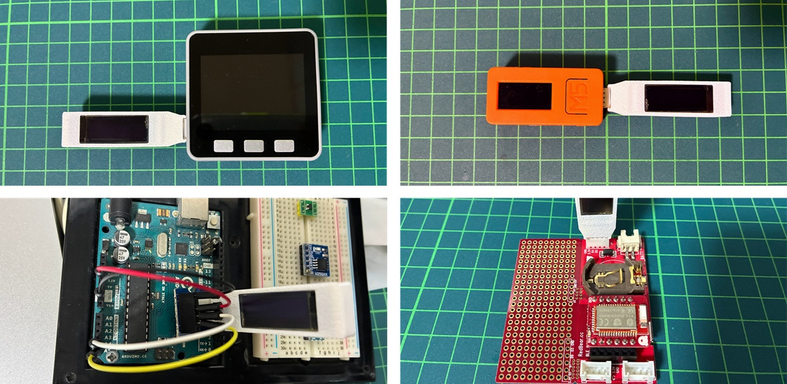
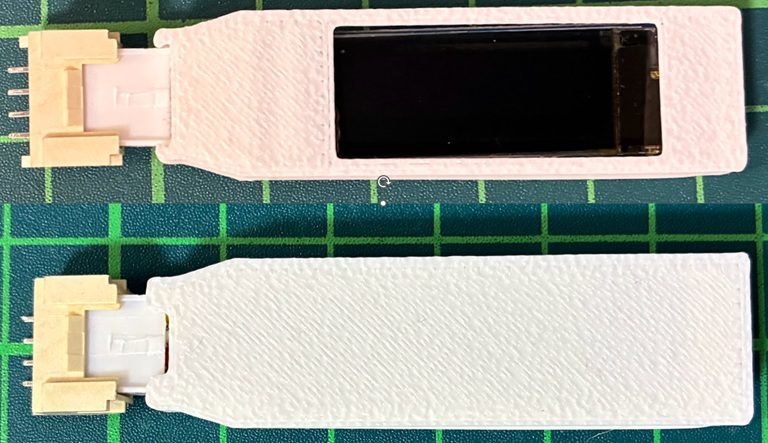

# GroveLcdStick
Groveコネクタを備えた、I2C接続のコンパクトなLCDディスプレイです。扱いやすさと利便性を追求し、USBメモリスティックのようなデザインにしました。

既存の市販品をオリジナルデザインの筐体に収めることで、コンパクトで使いやすいデバイスを実現しています。

## 作成の背景
I2C接続の0.91インチOLEDディスプレイを購入しましたが、ブレッドボード上での利用ではなく、Groveコネクタを持つ製品ともっと手軽に安全に接続するために、USBステック風の筐体デザインを作成しました。
下記の画像は、私の作った[ボタン基板(ABXY-buttons)](https://github.com/carcon999/ABXY-buttons)のGroveコネクタに接続したものです。

市販のI2C接続の0.91インチOLEDディスプレイは、ブレッドボードでの利用が一般的です。しかし、Groveコネクタを持つ他のデバイスと、より手軽かつ安全に接続したいと考え、USBスティックのようなデザインの筐体を作成しました。

以下の画像は、私が作成した[ボタン基板(ABXY-buttons)](https://github.com/carcon999/ABXY-buttons)のGroveコネクタに接続した例です。

最近の多くの製品は標準でディスプレイを備えていますが、デバッグ時に画面を追加したい場合や、Arduino Unoのようなデバイスでも手軽に利用できるように、このGroveLcdStickを制作しました。

## 作成に必要なもの
|イメージ| 必要なもの | 内容 | リンク |
|--------|--------|--------|--------|
|| 小型ディスプレイ | OLEDディスプレイ | 「0.91インチ OLED」で検索すると多数見つかります。 |
|| Groveコネクタ | ケーブル付きのGroveオス |  |
|| エンクロージャ（上） | ケース上側 | [Enclosure_top.stl](./3d-model/Enclosure_top.stl) |
|| エンクロージャ（下） | ケース下側 | [Enclosure_bottom.stl](./3d-model/Enclosure_bottom.stl) |

### ディスプレイについて
本プロジェクトでは、市販されている**128x32ピクセル**の超小型OLEDディスプレイを使用します。制御チップに**SSD1306**を利用しており、基板サイズが**38.5 × 12.3 mm**程度の互換製品が多数流通しています（0.5 mm程度の誤差は許容されます）。

## 組み立て方
### 1\. Groveコネクタの向きを決める
GroveLcdStickを接続する**デバイスのGroveコネクタ（メス）の向き**を確認し、ディスプレイが見やすいようにGroveコネクタ（オス）の向きを決めます。以下の画像のように、Groveコネクタの向きによってディスプレイの向きが変わります。

### 2\. Groveコネクタの爪をカットする（任意）

接続するデバイスによっては、Groveコネクタの爪が邪魔になることがあります。必要に応じて、ニッパーで爪をカットすることをおすすめします。爪がないほうが抜き差ししやすく、扱いやすくなります。

### 3\. OLEDディスプレイをエンクロージャに入れる

エンクロージャ（上）にOLEDディスプレイをはめ込みます。

### 4\. Groveコネクタを差し込む

Groveコネクタ（オス）の左右にある出っ張りが、エンクロージャの切り欠きに合うように、上からスライドさせて押し込みます。

### 5\. はんだ付けする

ケーブルの長さを調整し、OLEDディスプレイにはんだ付けします。ケーブルが太いため、ケース内にきれいに収まるように長さを確認しながら作業してください。Groveコネクタの向きによって配線がクロスすることがあるので、以下の画像を参考にしてください。

### 6\. 蓋をする

エンクロージャ（下）をはめ込みます。必要に応じて、接着剤やホットボンドなどで固定してください。

## 動作確認

動作確認には、[Adafruit_SSD1306](https://github.com/adafruit/Adafruit_SSD1306) ライブラリの使用をオススメします。`ssd1306_128x32_i2c`のサンプルスケッチで動作確認ができるはずです。お使いの環境によってI2Cのピン配置が異なる場合があるため、ご注意ください。

## 注意事項

エンクロージャとGroveコネクタの接続部分は、それほど強度が高くありません。抜き差しする際は、破損を防ぐため、**エンクロージャの根本を軽く押さえながら操作する**ことをオススメします。

